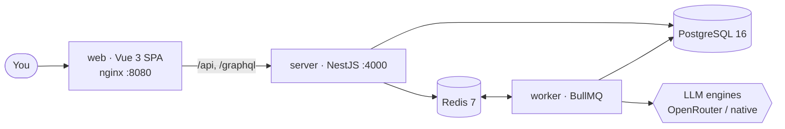

<div align="center">

# Ideata

### Open-source **AEO tracker** + **AI content studio** — self-hosted in one command.

See how ChatGPT, Claude, Gemini, Perplexity & friends talk about your brand —
then out-publish your competitors with an AI writing studio built right in.

<br/>

<a href="#-quick-start"></a>
<a href="https://vuejs.org"></a>
<a href="https://nestjs.com"></a>
<a href="https://www.postgresql.org"></a>
<a href="#-contributing"></a>
<a href="#-quick-start"></a>
<a href="LICENSE"></a>

[Quick start](#-quick-start) · [Features](#-features) · [Configuration](#%EF%B8%8F-configuration) · [Architecture](#-architecture) · [Roadmap](#%EF%B8%8F-roadmap)

</div>

<br/>

## Why Ideata?

Search moved into the chat box. People ask **ChatGPT** and **Perplexity** for recommendations
instead of scrolling ten blue links. **AEO — Answer Engine Optimization — is the new SEO**, and
Ideata is the open, self-hosted way to measure it and win it.

- 🔎 **Track your AI visibility.** Run your real buyer prompts across 8+ engines and see exactly when you're mentioned, cited, or ignored — and who gets recommended instead of you.
- 🏆 **Benchmark competitors.** Share of voice, sentiment, and which sources the models actually trust.
- ✍️ **Close the gap.** A built-in AI writing studio that researches, drafts, and multi-posts content engineered to get cited back.
- 🔒 **Own everything.** Runs entirely on your infrastructure. Bring your own API keys. No seats, no per-report fees, no limits.

<br/>

## ✨ Features

<table>
<tr>
<td width="50%" valign="top">

### 📡 AEO tracking

- **8+ answer engines** — ChatGPT, Claude, Gemini, Perplexity, DeepSeek, Grok + regional **Yandex** (Alice / Neuro) & **GigaChat**
- **Prompt panels** — track dozens of real prompts, run on a daily schedule
- **Mentions & citations** — read the exact AI answers that name you
- **Competitor analysis** — share of voice, sentiment, source leaderboard
- **AI-crawler analytics** — GPTBot, ClaudeBot & co. via Cloudflare
- **AI-referred traffic** — Yandex Metrica + Google Search Console

</td>
<td width="50%" valign="top">

### ✍️ Blog Writer studio

- **Full pipeline** — brief → research → outline → draft → anti-slop → fact-check
- **Per-article model** with a live price estimate before you spend a token
- **Brand-voice agent** — one prompt, quality gates, target length & sources
- **Cover studio** — 50+ templates, PNG composited in the browser
- **Multi-posting** — adapt one article to Telegram / VK / Threads / Zen
- **Content calendar** + idea generator

</td>
</tr>
</table>

### 🛠️ Built for self-hosting

- **One `docker compose up`** brings up Postgres, Redis, the API, the worker and the dashboard.
- **Bring your own keys** through a slick in-app Settings UI — one OpenRouter key for everything, or native per-provider keys for geo-control.
- **Bilingual dashboard** — English / Русский, switchable in a click.
- **No phone-home.** Everything runs on your machine.

<br/>

## 🚀 Quick start

```bash
git clone https://github.com/your-org/ideata-app.git
cd ideata-app
cp .env.example .env          # add at least one LLM key (e.g. OPENROUTER_API_KEY)
docker compose up -d --build
```

Then open **http://localhost:8080**, sign up (the first account becomes the
**owner/admin**), go to **Settings → Providers**, paste your keys, and run your
first analysis.

No cloud account. No credit card. Just Docker.

<br/>

## ⚙️ Configuration

Everything is configured through `.env` (see [`.env.example`](.env.example)) or, once
you're the owner, straight from the dashboard. The only thing you truly need is **model access** —
and there are two ways to give it.

### 🔀 Models — OpenRouter *or* native keys

**Option A · OpenRouter** — the simple path. One key routes every model:

```env
OPENROUTER_API_KEY=sk-or-...   # ChatGPT · Claude · Gemini · DeepSeek · Grok · Perplexity
```

**Option B · Native provider keys** — bring the official key for each engine you want (per-engine, better geo-control):

| Engine | Variable |
| --- | --- |
| ChatGPT (OpenAI) | `OPENAI_API_KEY` |
| Claude (Anthropic) | `ANTHROPIC_API_KEY` |
| Gemini (Google) | `GEMINI_API_KEY` |
| DeepSeek | `DEEPSEEK_API_KEY` |
| Grok (xAI) | `XAI_API_KEY` |
| Perplexity | `PERPLEXITY_API_KEY` |
| GigaChat | `GIGACHAT_API_KEY` |
| Yandex GPT | `YANDEX_SEARCH_API_KEY` |

> Flip between the two anytime in **Settings → Engines**. GigaChat & Yandex GPT are native-only (regional engines).

### Everything else (all optional)

| Variable | What it unlocks |
| --- | --- |
| `DATAFORSEO_*` / `KEYSSO_API_KEY` | competitor & keyword SEO data |
| `RESEND_API_KEY` / `SMTP_FROM` | weekly report emails |
| `YANDEX_*` (OAuth) | Yandex Metrica — AI-assistant traffic |
| `GOOGLE_*` / `GSC_REDIRECT_URI` | Google Search Console |
| `OSS_UNLOCKED` | `1` = all features on, no paywall (default) |

<br/>

## 🧱 Architecture



| Layer | Stack |
| --- | --- |
| Dashboard | Vue 3 · Vite · Tailwind v4 |
| API & Worker | NestJS · Prisma · BullMQ |
| Data | PostgreSQL 16 · Redis 7 |
| Models | OpenRouter, or native provider keys |

<br/>

## 🌍 Localization

The dashboard is **bilingual (English / Русский)** via a frontend i18n layer.
Backend messages default to English; language-dependent **product content**
(weekly reports, LLM prompts) is generated in the language of the tracked site.
New UI locales are welcome — they live in the frontend translation dictionaries.

<br/>

## 🗺️ Roadmap

- [ ] More answer engines & regional assistants
- [ ] Native-API dispatch with per-country geo-targeting
- [ ] Scheduled PDF/email visibility reports out of the box
- [ ] One-click deploy templates (Railway / Render / Coolify)

<br/>

## 🤝 Contributing

Issues and PRs are very welcome. Spin it up locally, break something, send a fix.
If you add a feature that touches the UI, keep it token-driven so it works in both themes.

## 📄 License

[AGPL-3.0](LICENSE) — free to self-host, modify and use commercially. If you run a
modified version as a network service, you have to share your changes under the same
license. Same deal as Postiz, Grafana and friends.

<div align="center">
<br/>
<sub>Built for a world where the answer box is the new front page.</sub>
</div>
